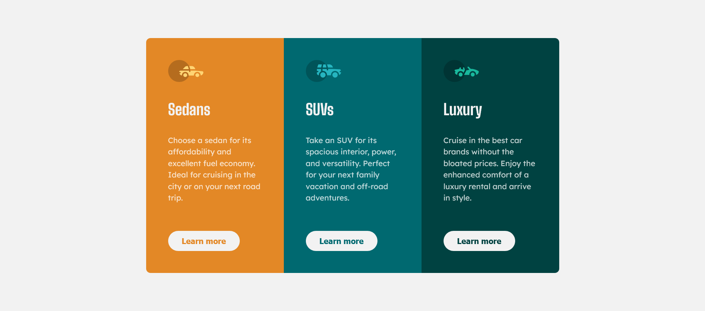
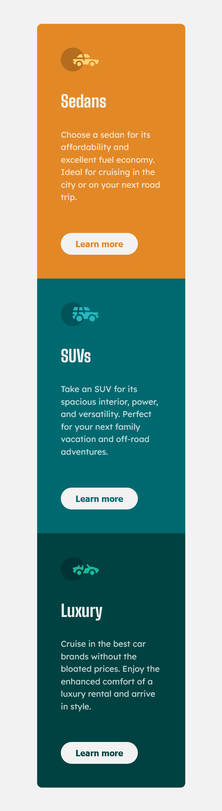

# Frontend Mentor - 3-column preview card component solution


This is a solution to the [3-column preview card component challenge on Frontend Mentor](https://www.frontendmentor.io/challenges/3column-preview-card-component-pH92eAR2-). Frontend Mentor challenges help you improve your coding skills by building realistic projects. 

## Table of contents

- [Overview](#overview)
  - [The challenge](#the-challenge)
  - [Screenshot](#screenshot)
  - [Links](#links)
- [My process](#my-process)
  - [Built with](#built-with)
  - [What I learned](#what-i-learned)
  - [Continued development](#continued-development)
  - [Useful resources](#useful-resources)
- [Author](#author)
- [Acknowledgments](#acknowledgments)

## Overview

This repository is a static HTML/CSS implementation of the Frontend Mentor "3-column preview card component" challenge. The project demonstrates a responsive three-card layout with per-card accent colors, accessible semantics, and a hover interaction on each card's call-to-action.

### The challenge

Key requirements implemented in this solution:

- Display three colored preview cards side-by-side on wide screens.
- Stack cards vertically on small screens (mobile-first responsive behavior).
- Provide a clear, non-jarring hover state for the CTA buttons (no layout shift).
- Use CSS custom properties for colors and consistent spacing.

### Screenshot

#### Desktop


#### Mobile



### Links

- [Solution URL](https://www.frontendmentor.io/solutions/3-column-preview-card-rZzV8hpmlu)
- [Live Site URL](https://transcendent-sopapillas-5fb2e4.netlify.app/)

## My process

### Built with

- Semantic HTML5
- Plain CSS with custom properties (declared in `:root`)
- Flexbox for the three-column layout
- Media queries for responsive stacking and spacing
- Google Fonts for typography

### What I learned

- How to use `:nth-child()` correctly to target elements inside each card (e.g., `.card:nth-child(2) .btn`).
- Why `box-shadow` can be preferable to `border` for hover outlines (prevents layout shift and creates a visually centered stroke).
- Practical structuring of a simple, accessible component using semantic markup and a mobile-first approach.
- How to expose themeable values via CSS custom properties so colors and spacing are easy to tweak.

Example snippets from this project:

```css
:root {
  --Gold-500: hsl(31, 77%, 52%);
  --Cyan-800: hsl(184, 100%, 22%);
  --Green-950: hsl(179, 100%, 13%);
}

.card:nth-child(2) .btn {
  color: var(--Cyan-800);
}

.btn:hover {
  box-shadow: 0 0 0 2px var(--Transparent-white);
}
```

### Continued development

- Extract the inline stylesheet from `index.html` into a separate `styles.css` file to improve maintainability.
- Add more accessibility features (focus states, ARIA labels where appropriate, keyboard testing).
- Add unit visual tests or screenshot tests for regression detection if the project grows.
- Add slight motion (transitions) for entrance animations or hover micro-interactions.

### Useful resources

- [Frontend Mentor challenge page](https://www.frontendmentor.io/challenges/3column-preview-card-component-pH92eAR2-)
- [MDN Web Docs — CSS variables](https://developer.mozilla.org/en-US/docs/Web/CSS/Using_CSS_custom_properties)
- [MDN Web Docs — box-shadow](https://developer.mozilla.org/en-US/docs/Web/CSS/box-shadow)
-[MDN Web Docs — Flexbox guide](https://developer.mozilla.org/en-US/docs/Web/CSS/CSS_Flexible_Box_Layout/Basic_Concepts_of_Flexbox)

## Author

- Linkedin - [Linkedin](www.linkedin.com/in/abiramisri)
- Frontend Mentor - [@Abiramisri](https://www.frontendmentor.io/profile/Abiramisri2k)
- Github - [@Abiramisri](https://github.com/Abiramisri2k)

## Acknowledgments

Thanks to Frontend Mentor for the challenge and to any contributors or references that inspired this solution.