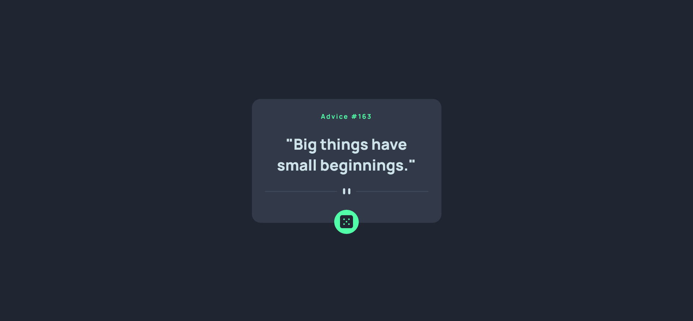
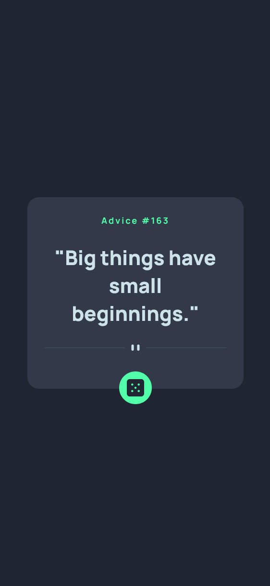

# Frontend Mentor - Advice generator app solution

This is a solution to the [Advice generator app challenge on Frontend Mentor](https://www.frontendmentor.io/challenges/advice-generator-app-QdUG-13db). Frontend Mentor challenges help you improve your coding skills by building realistic projects.

## Table of contents

- [Overview](#overview)
  - [The challenge](#the-challenge)
  - [Screenshot](#screenshot)
  - [Links](#links)
- [My process](#my-process)
  - [Built with](#built-with)
  - [What I learned](#what-i-learned)
  - [Useful resources](#useful-resources)
- [Author](#author)
- [Acknowledgments](#acknowledgments)

## Overview

### The challenge

Users should be able to:

- View the optimal layout for the app depending on their device's screen size
- See hover states for all interactive elements on the page
- Generate a new piece of advice by clicking the dice icon

### Screenshot

#### Desktop

#### Mobile

### Links

- Solution URL: [Add solution URL here](https://your-solution-url.com)
- [Live Site URL](https://exquisite-biscochitos-8cf02f.netlify.app/)

## My process

### Built with

- HTML5 semantic markup
- Modern CSS (Flexbox, clamp(), custom properties)
- Vanilla JavaScript (fetch API, DOM manipulation)
- Advice Slip API
- Mobile-first workflow

### What I learned

While building this project, I learned:

- How to fetch data from an API using fetch()
- How to prevent API caching using a unique timestamp
- How to dynamically update text using DOM methods
- How to use clamp() to create responsive card widths

### Useful resources

- [Advice Slip API](https://api.adviceslip.com/)
- MDN Fetch API — great for understanding API requests

## Author

- Linkedin - [Linkedin](www.linkedin.com/in/abiramisri)
- Frontend Mentor - [@Abiramisri](https://www.frontendmentor.io/profile/Abiramisri2k)
- Github - [@Abiramisri](https://github.com/Abiramisri2k)

## Acknowledgments

Thanks to Frontend Mentor for giving such practical UI challenges.
Special thanks to resources that helped improve my API and CSS skills.