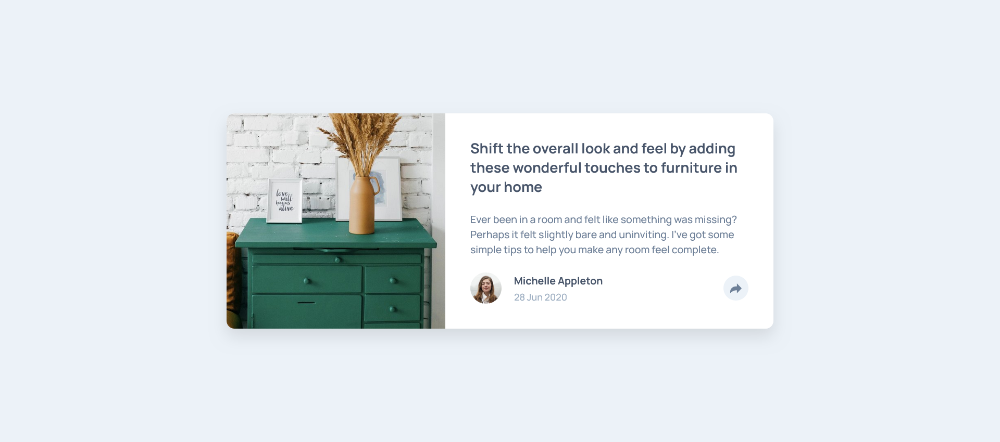
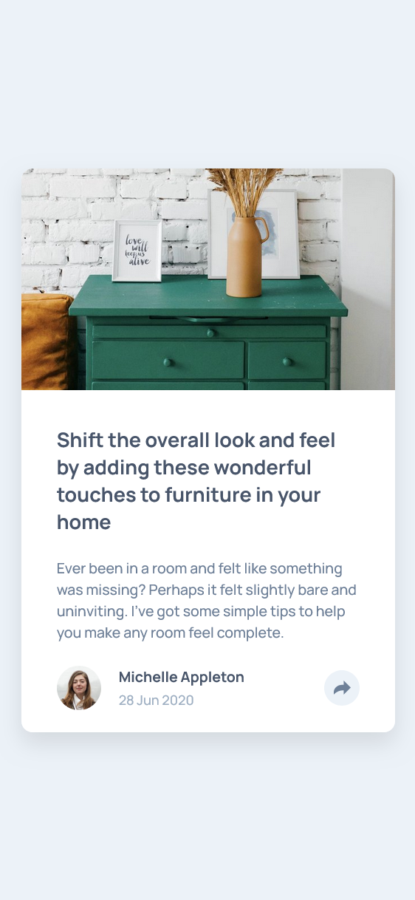

# Frontend Mentor - Article preview component solution


This is a solution to the [Article preview component challenge on Frontend Mentor](https://www.frontendmentor.io/challenges/article-preview-component-dYBN_pYFT). Frontend Mentor challenges help you improve your coding skills by building realistic projects. 

## Table of contents

- [Overview](#overview)
  - [The challenge](#the-challenge)
  - [Screenshot](#screenshot)
  - [Links](#links)
- [My process](#my-process)
  - [Built with](#built-with)
  - [What I learned](#what-i-learned)
  - [Continued development](#continued-development)
- [Author](#author)
- [Acknowledgments](#acknowledgments)


## Overview

### The challenge

Users should be able to:

- View the optimal layout for the component depending on their device's screen size
- See the social media share links when they click the share icon

### Screenshot

#### Desktop


#### Mobile


### Links

- Solution URL: [Add solution URL here](https://your-solution-url.com)
- Live Site URL: [Add live site URL here](https://your-live-site-url.com)

## My process

### Built with

- Semantic HTML5 markup
- CSS custom properties
- Flexbox
- CSS Grid
- Mobile-first workflow

### What I learned

While building this project, I learned:

- How to position and toggle a popup based on the viewport size
- Handling show/hide logic using JavaScript
- Preventing click events from closing the popup prematurely
- Using media queries to adjust layout and popup design for mobile
- Creating a circular button with SVG icons
- Improving CSS structure using variables and spacing

Example of my improved learning:
```
shareBtn.addEventListener('click', () => {
  popup.classList.toggle('hidden');
});

```

### Continued development

In future projects, I want to improve:

- More advanced component animations
- Better click-event handling for popups/modals
- Creating reusable UI components
- Accessibility (focus states, keyboard navigation)
- Using BEM or utility CSS for cleaner structure

## Author

- Linkedin - [Linkedin](www.linkedin.com/in/abiramisri)
- Frontend Mentor - [@Abiramisri](https://www.frontendmentor.io/profile/Abiramisri2k)
- Github - [@Abiramisri](https://github.com/Abiramisri2k)

## Acknowledgments

Thanks to the Frontend Mentor community, whose solutions helped me understand clean layouts and responsive design patterns.
