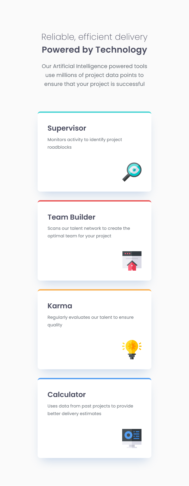

# Frontend Mentor - Four card feature section solution

This is a solution to the [Four card feature section challenge on Frontend Mentor](https://www.frontendmentor.io/challenges/four-card-feature-section-weK1eFYK). Frontend Mentor challenges help you improve your coding skills by building realistic projects. 

## Table of contents

- [Overview](#overview)
  - [The challenge](#the-challenge)
  - [Screenshot](#screenshot)
  - [Links](#links)
- [My process](#my-process)
  - [Built with](#built-with)
  - [What I learned](#what-i-learned)
  - [Continued development](#continued-development)
  - [Useful resources](#useful-resources)
- [Author](#author)
- [Acknowledgments](#acknowledgments)

## Overview

### The challenge

Users should be able to:

- View the optimal layout for the site depending on their device's screen size

### Screenshot

#### Desktop


#### Mobile



### Links

- Solution URL: [Add solution URL here](https://your-solution-url.com)
- Live Site URL: [Add live site URL here](https://your-live-site-url.com)

## My process

### Built with

- Semantic HTML5 markup
- CSS3 Grid and Flexbox for layout
- Responsive design using media queries
- Google Fonts (Poppins) for typography
- Box-shadow and color variables for consistent styling

### What I learned

While working on this project, I learned how to:

- Use CSS Grid to create a 3-column layout that adapts to smaller screens
- Combine Flexbox inside Grid items for better content alignment
- Use CSS variables for managing theme colors efficiently
- Apply hover effects with smooth transitions
- Create a clean and scalable responsive design structure

Here’s an example of code I’m proud of:

```
.grid-container {
  display: grid;
  grid-template-columns: repeat(3, 1fr);
  align-items: center;
  gap: 30px;
  transition: transform 0.3s ease;
}

.card:hover {
  transform: translateY(-5px);
}

```

### Continued development

In future projects, I want to focus more on:

- Using CSS clamp() for better responsive typography
- Adding animations (e.g., fade-in on scroll)
- Trying CSS custom properties for dark/light theme switching
- Improving accessibility (ARIA roles, contrast, etc.)

### Useful resources

- [MDN Web Docs – CSS Grid](https://developer.mozilla.org/en-US/docs/Web/CSS/Guides/Grid_layout) - helped me structure the layout properly.
- [Frontend Mentor – Four Card Feature Section Challenge](https://www.frontendmentor.io/challenges/four-card-feature-section-weK1eFYK) - original challenge source.
- [CSS Tricks – Flexbox & Grid Guides](https://css-tricks.com/snippets/css/complete-guide-grid/) - for better understanding layout behaviors.

## Author

- Linkedin - [Linkedin](www.linkedin.com/in/abiramisri)
- Frontend Mentor - [@Abiramisri](https://www.frontendmentor.io/profile/Abiramisri2k)
- Github - [@Abiramisri](https://github.com/Abiramisri2k)

## Acknowledgments

A big thanks to Frontend Mentor for providing this design challenge and to the developer community for all the CSS layout tips shared online.