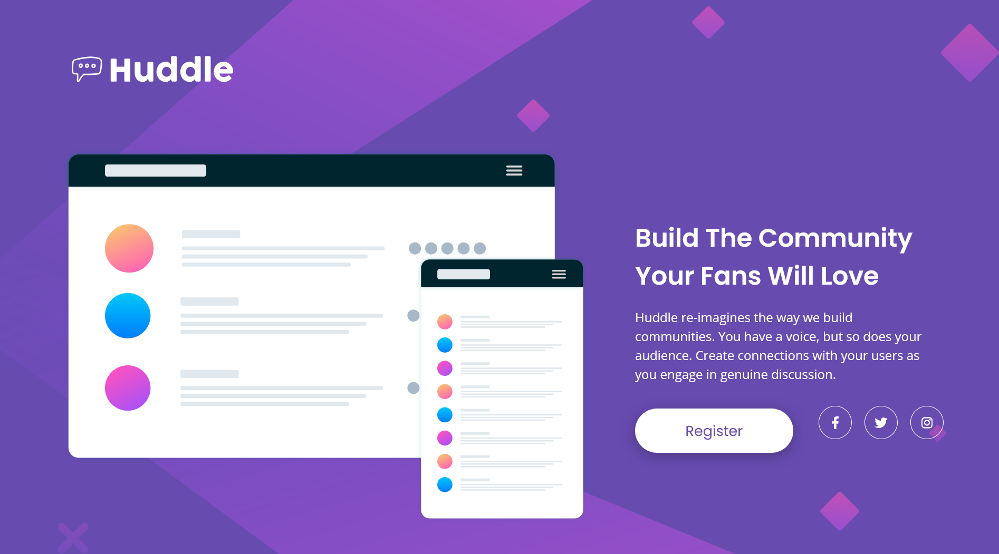
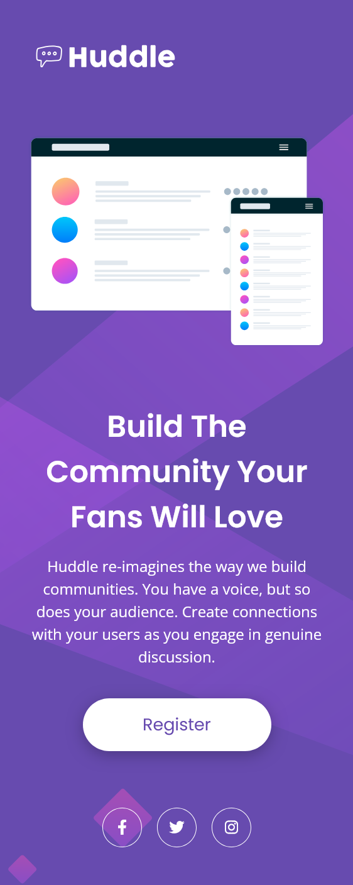

# Frontend Mentor - Huddle landing page with single introductory section solution

This is a solution to the [Huddle landing page with single introductory section challenge on Frontend Mentor](https://www.frontendmentor.io/challenges/huddle-landing-page-with-a-single-introductory-section-B_2Wvxgi0). Frontend Mentor challenges help you improve your coding skills by building realistic projects. 

## Table of contents

- [Overview](#overview)
  - [The challenge](#the-challenge)
  - [Screenshot](#screenshot)
  - [Links](#links)
- [My process](#my-process)
  - [Built with](#built-with)
  - [What I learned](#what-i-learned)
  - [Continued development](#continued-development)
  - [Useful resources](#useful-resources)
- [Author](#author)
- [Acknowledgments](#acknowledgments)


## Overview

### The challenge

Users should be able to:

View the optimal layout depending on their device's screen size.
See hover states for all interactive elements.
Experience a responsive design that works well on both desktop and mobile devices.

### Screenshot

#### Desktop



#### Mobile



### Links

- Solution URL: [Add solution URL here](https://your-solution-url.com)
- Live Site URL: [Add live site URL here](https://your-live-site-url.com)

## My process

### Built with

- Semantic HTML5 markup
- CSS3
- Flexbox
- CSS Variables
- Mobile-first workflow
- Google Fonts (Poppins & Open Sans)
- Font Awesome Icons

### What I learned

During this project, I practiced building a responsive landing page using Flexbox and media queries. I also learned how to create reusable styles using CSS variables and how to position elements like social media icons differently on desktop and mobile layouts.

Some key concepts I improved:

- Creating responsive layouts with Flexbox
- Using CSS variables for theme colors
- Adding hover effects with transitions
- Working with custom fonts from Google Fonts
- Positioning elements using fixed and static positioning

```css
.content button:hover 
   { background: var(--soft-magenta); 
     color: white; 
   }
```

### Continued development

In future projects, I would like to improve by:

- Writing more scalable CSS using methodologies like BEM.
- Improving accessibility by adding better focus states and ARIA labels.
- Learning CSS Grid for more advanced layouts.
- Optimizing performance by reducing unused CSS and improving image loading.

### Useful resources

- Frontend Mentor challenge description
- MDN Web Docs
- CSS Tricks Flexbox Guide
- Google Fonts
- Font Awesome

## Author

- Website - [Add your name here](https://www.your-site.com)
- Frontend Mentor - [@yourusername](https://www.frontendmentor.io/profile/yourusername)
- Twitter - [@yourusername](https://www.twitter.com/yourusername)


## Acknowledgments

Thanks to Frontend Mentor for providing this excellent challenge. It helped me strengthen my responsive web design skills and improve my understanding of Flexbox layouts, CSS styling, and responsive development. I also appreciate the helpful resources and guidance from the web development community throughout the learning process.
