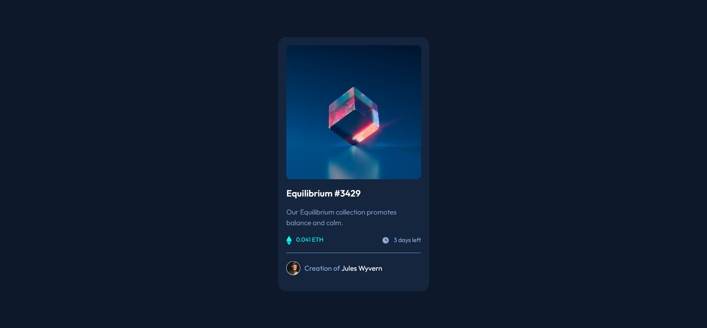
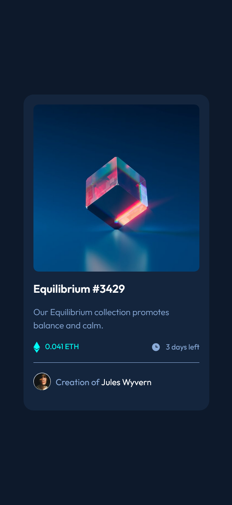

# Frontend Mentor - NFT preview card component solution

This is a solution to the [NFT preview card component challenge on Frontend Mentor](https://www.frontendmentor.io/challenges/nft-preview-card-component-SbdUL_w0U). Frontend Mentor challenges help you improve your coding skills by building realistic projects. 

## Table of contents

- [Overview](#overview)
  - [The challenge](#the-challenge)
  - [Screenshot](#screenshot)
  - [Links](#links)
- [My process](#my-process)
  - [Built with](#built-with)
  - [What I learned](#what-i-learned)
- [Author](#author)
- [Acknowledgments](#acknowledgments)

## Overview

### The challenge

Users should be able to:

- View the optimal layout depending on their device's screen size
- See hover states for interactive elements

### Screenshot

#### Desktop


#### Mobile


### Links

- [Solution URL](https://your-solution-url.com)
- [Live Site URL](https://your-live-site-url.com)

## My process

### Built with

- Semantic HTML5 markup
- CSS custom properties
- Flexbox
- CSS Grid
- Mobile-first workflow

### What I learned

This project helped me strengthen:

- How to use CSS positioning for overlay effects
- Using hsla() to create transparent background colors
- Building a hover effect without affecting child elements
- How to structure components cleanly using wrappers
- Centering content using CSS transform
- Better use of variables for colors and theme

Example code I’m proud of:

```
.img-wrapper .overlay {
  background-color: hsla(178, 100%, 50%, 0.5);
  opacity: 0;
  transition: 0.3s ease;
}

.img-wrapper:hover .overlay {
  opacity: 1;
}

```

## Author

- Linkedin - [Linkedin](www.linkedin.com/in/abiramisri)
- Frontend Mentor - [@Abiramisri](https://www.frontendmentor.io/profile/Abiramisri2k)
- Github - [@Abiramisri](https://github.com/Abiramisri2k)

## Acknowledgments

Special thanks to Frontend Mentor community for feedback and design guidance.