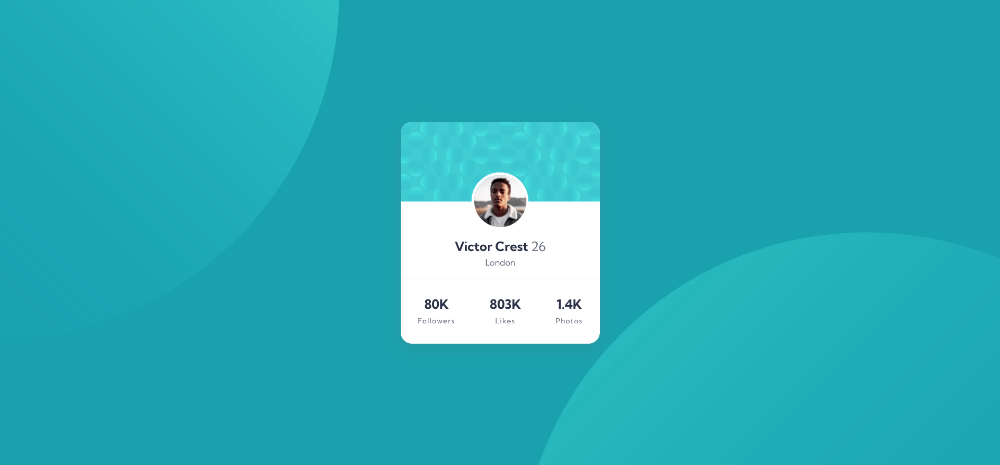
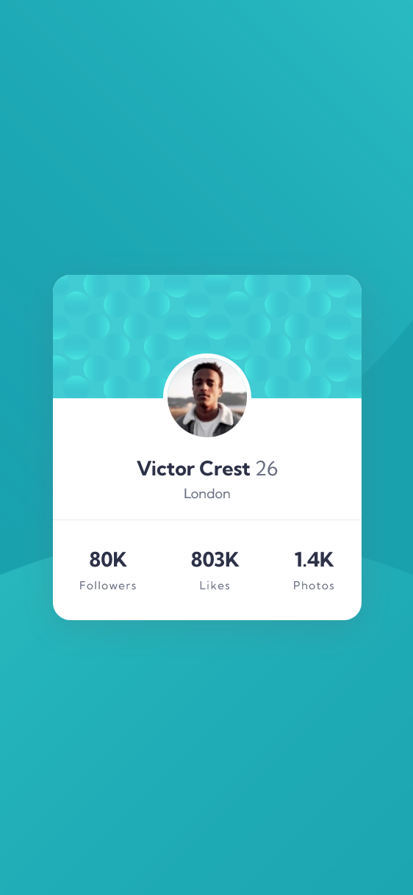

# Frontend Mentor - Profile card component solution


This is a solution to the [Profile card component challenge on Frontend Mentor](https://www.frontendmentor.io/challenges/profile-card-component-cfArpWshJ). Frontend Mentor challenges help you improve your coding skills by building realistic projects. 

## Table of contents

- [Overview](#overview)
  - [The challenge](#the-challenge)
  - [Screenshot](#screenshot)
  - [Links](#links)
- [My process](#my-process)
  - [Built with](#built-with)
  - [What I learned](#what-i-learned)
- [Author](#author)
- [Acknowledgments](#acknowledgments)

## Overview

### The challenge

- Build out the project to the designs provided

### Screenshot

#### Desktop


#### Mobile


### Links

- [Solution URL](https://www.frontendmentor.io/solutions/profile-card-sUKydlIpg3)
- [Live Site URL](https://fastidious-toffee-ee3fef.netlify.app/)

## My process

### Built with

- Semantic HTML5 markup
- CSS custom properties
- Flexbox
- CSS Grid
- Mobile-first workflow

### What I learned

I learned how to set multiple background images on the body using a single background-image property and control their positions:

```
background-image: url("./images/bg-pattern-top.svg"),
                  url("./images/bg-pattern-bottom.svg");

background-repeat: no-repeat, no-repeat;

background-position: left -500px top -500px,
                     right -300px bottom -650px;

```

This helped me achieve the curved shapes on the top-left and bottom-right, similar to the challenge design.

## Author

- Linkedin - [Linkedin](www.linkedin.com/in/abiramisri)
- Frontend Mentor - [@Abiramisri](https://www.frontendmentor.io/profile/Abiramisri2k)
- Github - [@Abiramisri](https://github.com/Abiramisri2k)

## Acknowledgments

Thanks to Frontend Mentor for providing such clean and minimal UI challenges that help improve CSS layout skills.