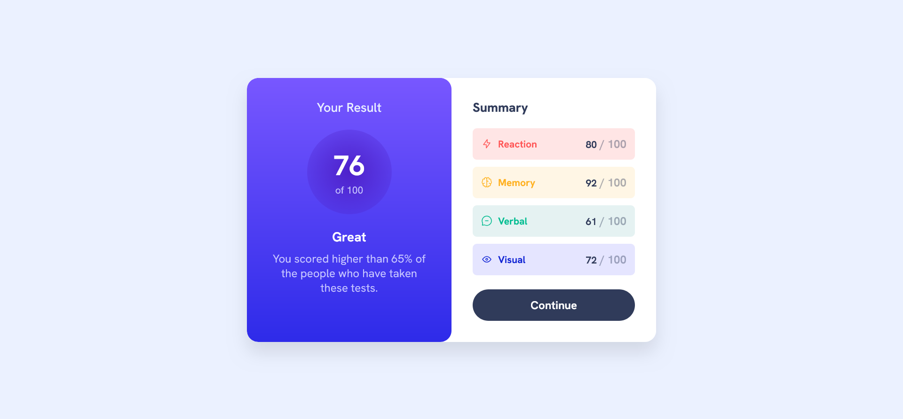
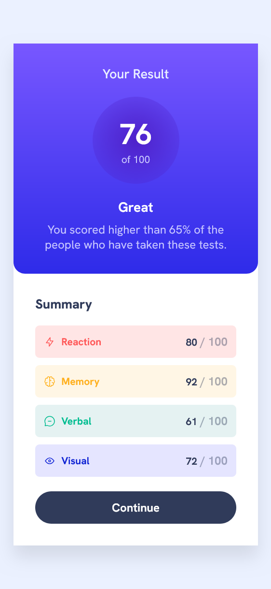

# Frontend Mentor - Results summary component solution

This is a solution to the [Results summary component challenge on Frontend Mentor](https://www.frontendmentor.io/challenges/results-summary-component-CE_K6s0maV). Frontend Mentor challenges help you improve your coding skills by building realistic projects. 

## Table of contents

- [Overview](#overview)
  - [The challenge](#the-challenge)
  - [Screenshot](#screenshot)
  - [Links](#links)
- [My process](#my-process)
  - [Built with](#built-with)
  - [What I learned](#what-i-learned)
  - [Continued development](#continued-development)
  - [Useful resources](#useful-resources)
- [Author](#author)
- [Acknowledgments](#acknowledgments)

## Overview

### The challenge

Users should be able to:
- View the optimal layout for the interface depending on their device's screen size
- See hover and focus states for all interactive elements on the page
- Dynamically populate the results using the provided `data.json` file (optional bonus)

This project is a great opportunity to practice semantic HTML, CSS custom properties, responsive design, and optionally, JavaScript for dynamic content loading.

### Screenshot

#### Desktop View

#### Mobile View

### Links

- [Frontend Mentor Solution](https://www.frontendmentor.io/solutions/results-summary-component)
- [Live Demo](https://your-live-site-url.com)

## My process

### Built with

- Semantic HTML5 markup
- CSS custom properties (variables)
- Flexbox for layout
- Mobile-first workflow
- JavaScript (for dynamic content loading from `data.json`)

### What I learned

- How to create a visually appealing and accessible results summary component
- Using CSS custom properties to maintain consistent theming
- Implementing responsive design with flexbox and media queries
- Dynamically populating content using JavaScript and JSON data

### Continued development

- Explore using CSS Grid for alternative layout approaches
- Add more interactive features with JavaScript (e.g., animations, transitions)
- Implement accessibility improvements (ARIA labels, keyboard navigation)

### Useful resources

- [Frontend Mentor Challenge](https://www.frontendmentor.io/challenges/results-summary-component-CE_K6s0maV)
- [MDN Web Docs - Flexbox](https://developer.mozilla.org/en-US/docs/Web/CSS/CSS_Flexible_Box_Layout/Basic_Concepts_of_Flexbox)
- [CSS Custom Properties Guide](https://developer.mozilla.org/en-US/docs/Web/CSS/Using_CSS_custom_properties)

## Author

- [Linkedin](www.linkedin.com/in/abiramisri)
- [Frontend Mentor - @Abiramisri](https://www.frontendmentor.io/profile/Abiramisri2k)
- [Github](https://github.com/Abiramisri2k)

## Acknowledgments

Special thanks to Frontend Mentor for providing this challenge and the design assets. Also, thanks to the community for their support and feedback.