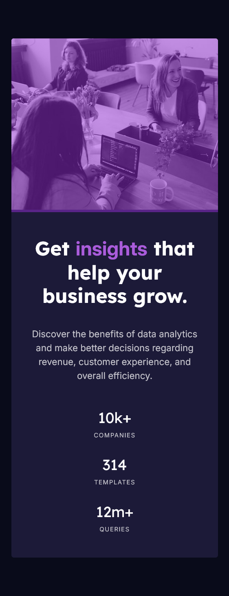

# Frontend Mentor - Stats preview card component solution


This is a solution to the [Stats preview card component challenge on Frontend Mentor](https://www.frontendmentor.io/challenges/stats-preview-card-component-8JqbgoU62). Frontend Mentor challenges help you improve your coding skills by building realistic projects. 

## Table of contents

- [Overview](#overview)
  - [The challenge](#the-challenge)
  - [Screenshot](#screenshot)
  - [Links](#links)
- [My process](#my-process)
  - [Built with](#built-with)
  - [What I learned](#what-i-learned)
  - [Continued development](#continued-development)
  - [Useful resources](#useful-resources)
- [Author](#author)
- [Acknowledgments](#acknowledgments)

## Overview

### The challenge

Users should be able to:

- View the optimal layout depending on their device's screen size

### Screenshot

#### Desktop


#### Mobile


### Links

- [Solution URL](https://your-solution-url.com)
- [Live Site URL](https://your-live-site-url.com)

## My process

### Built with

- Semantic HTML5 markup
- CSS custom properties
- Flexbox
- CSS Grid
- Mobile-first workflow

### What I learned

- How to create a two-column card layout using Flexbox
- How to apply a color overlay on an image using ::after
- How to make the layout responsive
- How to reverse flex direction on mobile using:

```
.container {
  flex-direction: column-reverse;
}

```
- Handling mobile-specific image:

```
.right-side img {
  background-image: url(./images/image-header-mobile.jpg);
}

```

### Continued development

Areas to focus on next:

- Improve responsive typography
- Learn CSS Grid for more layout control
- Try converting this project to React for practice
- Explore dark/light theme support

### Useful resources

- [MDN CSS Flexbox Guide](https://developer.mozilla.org/en-US/docs/Web/CSS/Reference/Properties/flex) 

## Author

- Linkedin - [Linkedin](www.linkedin.com/in/abiramisri)
- Frontend Mentor - [@Abiramisri](https://www.frontendmentor.io/profile/Abiramisri2k)
- Github - [@Abiramisri](https://github.com/Abiramisri2k)

## Acknowledgments

Thanks to the Frontend Mentor community, whose solutions helped me understand clean layouts and responsive design patterns.