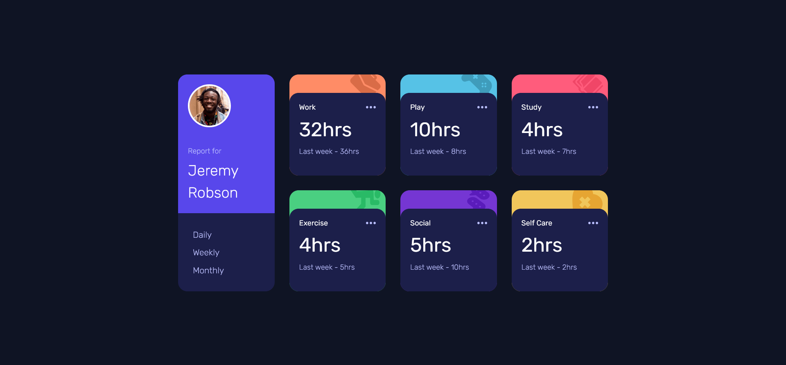
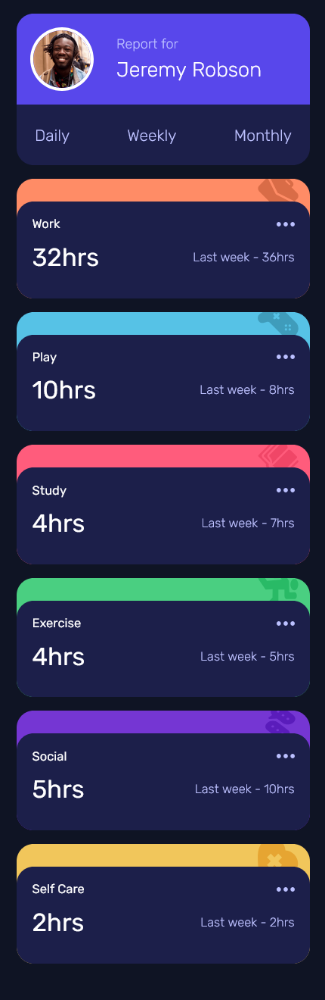

# Frontend Mentor - Time tracking dashboard solution


This is a solution to the [Time tracking dashboard challenge on Frontend Mentor](https://www.frontendmentor.io/challenges/time-tracking-dashboard-UIQ7167Jw). Frontend Mentor challenges help you improve your coding skills by building realistic projects. 

## Table of contents

- [Overview](#overview)
  - [The challenge](#the-challenge)
  - [Screenshot](#screenshot)
  - [Links](#links)
- [My process](#my-process)
  - [Built with](#built-with)
  - [What I learned](#what-i-learned)
- [Author](#author)
- [Acknowledgments](#acknowledgments)

## Overview

### The challenge

Users should be able to:

- View the optimal layout for the site depending on their device's screen size
- See hover states for all interactive elements on the page
- Switch between viewing Daily, Weekly, and Monthly stats

### Screenshot

#### Desktop


#### Mobile


### Links

- [Solution URL](https://your-solution-url.com)
- [Live Site URL](https://your-live-site-url.com)

## My process

### Built with

- Semantic HTML5 markup
- CSS custom properties
- Flexbox
- CSS Grid
- Mobile-first workflow

### What I learned

**Turning static HTML into dynamic content**

I learned how to load UI content from a data.json file and update it based on user interaction.

**Mapping JSON data to UI**

```
title.textContent = data[index].title;
hours.textContent = data[index].timeframes.weekly.current + "hrs";
status.textContent = "Last week - " + data[index].timeframes.weekly.previous + "hrs";
```
**Adding dynamic timeframe switching**

Using data-timeframe attributes made it easy to switch between daily, weekly, and monthly.

```
const timeframe = link.getAttribute("data-timeframe");
```
**Improving responsive design**

I used CSS Grid for desktop and switched to a single-column layout for mobile.

**Hover and active states**

Handled hover effects and active link styles to improve usability.

## Author

- [Linkedin](www.linkedin.com/in/abiramisri)
- [Frontend Mentor - @Abiramisri](https://www.frontendmentor.io/profile/Abiramisri2k)
- [Github](https://github.com/Abiramisri2k)

## Acknowledgments

Special thanks to Frontend Mentor for this challenge.
It helped me practice working with JSON data, improving my JavaScript skills, and building responsive layouts.