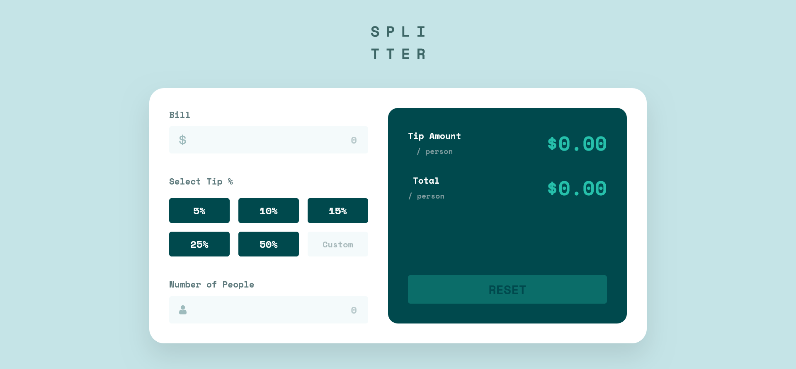
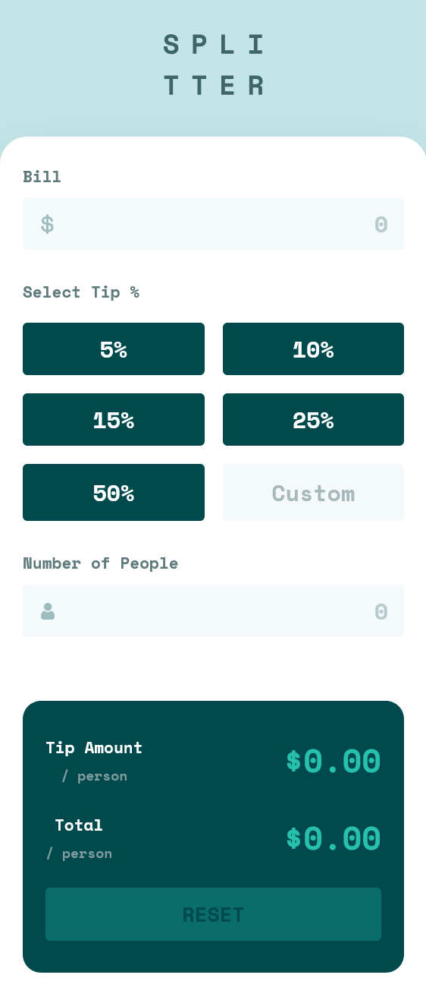

# Frontend Mentor - Tip calculator app solution

This is a solution to the [Tip calculator app challenge on Frontend Mentor](https://www.frontendmentor.io/challenges/tip-calculator-app-ugJNGbJUX). Frontend Mentor challenges help you improve your coding skills by building realistic projects.

## Table of contents

- [Overview](#overview)
  - [The challenge](#the-challenge)
  - [Screenshot](#screenshot)
  - [Links](#links)
- [My process](#my-process)
  - [Built with](#built-with)
  - [What I learned](#what-i-learned)
- [Author](#author)
- [Acknowledgments](#acknowledgments)

## Overview

### The challenge

Users should be able to:

- View the optimal layout for the app depending on their device's screen size
- See hover states for all interactive elements on the page
- Calculate the correct tip and total cost of the bill per person

### Screenshot

#### Desktop

#### Mobile

### Links

- [Solution URL](https://www.frontendmentor.io/solutions/tip-calculator-uLY5mxwYCY)
- [Live Site URL](https://astonishing-elf-ad6c7e.netlify.app/)

## My process

### Built with

- Semantic HTML5 markup
- CSS custom properties
- Flexbox
- CSS Grid
- Mobile-first workflow

### What I learned

While building this project, I learned and practiced:

- Handling **real-time input events** using `input` and `click`
- Using **data attributes** (`data-tip`) for cleaner logic
- Managing **active states** with CSS classes
- Performing calculations dynamically without page reload
- Validating user input (handling `0` and empty values)
- Structuring clean and reusable JavaScript functions
- Improving UX with visual feedback and error states

## Author

- [Linkedin](www.linkedin.com/in/abiramisri)
- [Frontend Mentor - @Abiramisri](https://www.frontendmentor.io/profile/Abiramisri2k)
- [Github](https://github.com/Abiramisri2k)

## Acknowledgments

- Thanks to Frontend Mentor for the UI inspiration
- Inspired by real-world tip calculator use cases
- Special thanks to the web dev community for learning resources 🙌